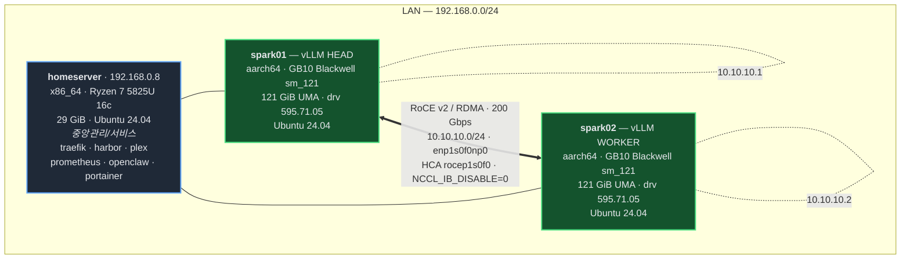
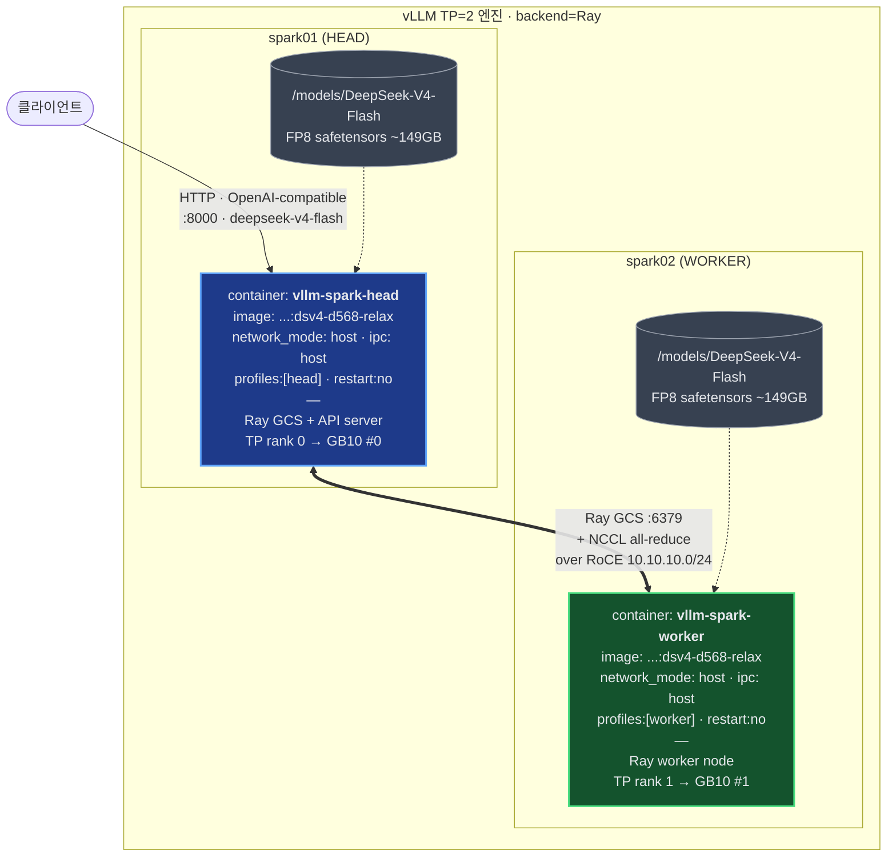
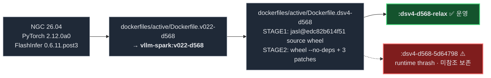

# 홈 인프라 & LLM 서빙 아키텍처

> 최종 갱신: 2026-05-26 · 라이브 상태 기준 (spark01 head + spark02 worker, `dsv4-d568-relax` 가동 중)

---

## 1. 하드웨어 & 네트워크 토폴로지

| 호스트 | Arch | CPU/GPU | RAM | LAN IP | RoCE IP | 역할 |
|---|---|---|---|---|---|---|
| `homeserver` | x86_64 | Ryzen 7 5825U (16c) | 29 GiB | 192.168.0.8 | — | 중앙 관리·서비스 (**빌드 금지**) |
| `spark01` | aarch64 | GB10 (sm_121) | 121 GiB UMA | LAN | **10.10.10.1** | vLLM **head** + Ray GCS |
| `spark02` | aarch64 | GB10 (sm_121) | 121 GiB UMA | LAN | **10.10.10.2** | vLLM **worker** |

> GB10은 **UMA**(host RAM + GPU 메모리 통합 121.63 GiB) — 별도 VRAM 풀 없음. 컨테이너 stop 시 드라이버에 RAM 고착, **reboot가 유일한 클린 회수책**.
> **빌드 규칙**: 모든 Docker/vLLM 빌드는 spark01 또는 spark02에서만. homeserver(29 GiB)는 OOM cascade로 freeze 발생 → 절대 금지.

---

## 2. LLM 서빙 컨테이너 아키텍처 (dual-RDMA TP=2)

### 모델 & 분산 설정

| 항목 | 값 |
|---|---|
| 모델 | **DeepSeek-V4-Flash** (FP8, ~149 GB), served name `deepseek-v4-flash` |
| 병렬 | **TP=2** dual-node, backend = **Ray** (GCS port 6379 over RoCE) |
| 컨텍스트 | `MAX_MODEL_LEN=200000` (`VLLM_ALLOW_LONG_MAX_MODEL_LEN=1`) |
| 배치 | `MAX_NUM_SEQS=8`, `MAX_NUM_BATCHED_TOKENS=8192` |
| 메모리 | `GPU_MEMORY_UTILIZATION=0.85`, `VLLM_SKIP_INIT_MEMORY_CHECK=1` (relax patch) |
| KV cache | `--kv-cache-dtype fp8`, `--block-size 256` |
| MoE | `--enable-expert-parallel`, `VLLM_TRITON_MLA_SPARSE=1` |
| Spec decode | **MTP** `deepseek_mtp`, `num_speculative_tokens=2` |
| CUDA graph | `cudagraph_mode=FULL_AND_PIECEWISE`, `custom_ops=["all"]` |
| 추론/툴 | `deepseek_v4` reasoning + tool-call parser, `<think>` 추론 활성 |
| Arch | `TORCH_CUDA_ARCH_LIST=12.1a` |

---

## 3. 이미지 빌드 스택

### 적용 패치 (STAGE 2, 3건)

1. **relax-profile-assertion** (`gpu_worker.py`) — post-profile `determine_available_memory()` assertion 우회
2. **G8 skip-init** (`utils.py`) — pre-init `request_memory()` free<requested 체크 우회
3. **envs-register** (`envs.py`) — `VLLM_USE_SPINLOOP_EXT` 등록

> `VLLM_SKIP_INIT_MEMORY_CHECK=1` 가 위 (1)·(2) assertion을 모두 우회 → UMA 환경의 init+profile memcheck 통과.

---

## 부록: 운영 노트

- **현재 운영 이미지**: `ghcr.io/bjk110/vllm-spark:dsv4-d568-relax` (jasl@edc82b614f51, 2026-05-19).
- **bump 보류**: `5d64798` (HEAD, 2026-05-25)는 빌드는 성공했으나 dual-GB10 load-time thrash로 양 노드 잠김 → power-cycle 후 relax 롤백. 원인 격리 전 재투입 금지.
- **clean shutdown**: `docker compose --profile head down` / `--profile worker down` (profiles 때문에 `--profile` 없으면 silently skip). stop 후 UMA RAM 회수 위해 reboot 필요.
